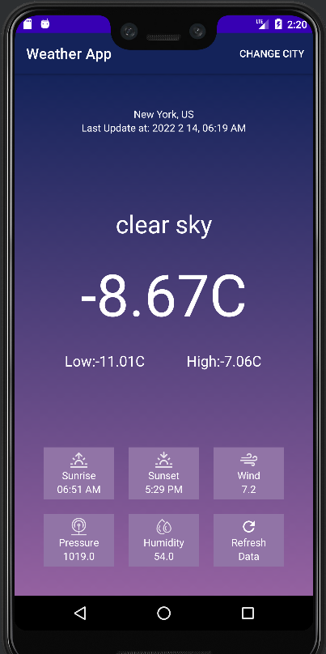

# Weather_App

A simple app for display the weather and other information such as: time of sunrise & sunset, wind speed, preseure and humidity.

I used api to get these information. The api from OpenWeather website (this is website link: https://openweathermap.org/api)

### v 1.0
#### This is home page

#### And this page for get waether by zip code

#### This is a way to change the unit

